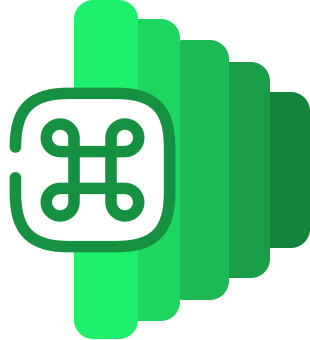

# Command+ API 

### v1.1.0,<br /> A lightweight Node.js command-line framework with a <u>built-in plugin system</u>, <u>internationalization support</u>, and <u>API call capabilities</u>.

---

**Docs / 文档主站 ：** http://wiki.hellowyq.com/docs/Command_API/install
**Docs2 / 文档备用站：** http://wangyqwiki.vercel.app/docs/Command_API/install
**Developer's Manual / 开发者手册：** https://wiki.hellowyq.com/docs/Command_API/02-developer
**Plugins Marketplace / 插件市场：** https://c-api-plugin.hellowyq.com/

---

> [!WARNING]
>
> **Plugins run in the same Node.js process.** While the `ctx` object provides context isolation, it is NOT a strict security sandbox. Loading untrusted third-party plugins may pose security risks (e.g., arbitrary code execution). So, it's recommended that you download reviewed plugins from the plugin website.
>
> **插件与主程序运行在同一个 Node.js 进程中。** 虽然 `ctx` 对象提供了上下文隔离，但它并非严格的安全沙箱。加载不可信的第三方插件可能存在安全风险（如任意代码执行）。因此，建议您从插件网站下载审核过的插件。

---

## **Language / 语言**

| [🇺🇸 English](#english) | [🇨🇳 简体中文](#%E7%AE%80%E4%BD%93%E4%B8%AD%E6%96%87) |

---

<a id="english"></a>

## 🇺🇸 English

### What is this?

Command+ API is a cross-platform command-line framework that adds a single extensible command to your terminal. It features a built-in plugin system — install plugin packages to add new commands, or easily write your own extension in just a few minutes. Check out the plugin marketplace: [Command+ API Plugin Marketplace](https://c-api-plugin.hellowyq.com/)

### Why use it?

* **One command, unlimited possibilities** — Add as many commands as you like via the plugin system. All plugins are invoked through `c xxx`.
* **Plugin ecosystem** — Drop a `.js` file into `lib/` to add a new command (as long as the plugin follows the required format).
* **Multi-language support** — Built-in support for Chinese, English, Spanish, and Russian, with more languages coming in the future.
* **Super lightweight** — The core code + `node_modules` is only 1.5MB (uncompiled).
* **MIT licensed** — Free for commercial use. You can even modify the source code.

### Installation

#### (Method 1) Direct install — unzip and run

Download the pre-built package for your platform from [Releases](https://github.com/GlassShadowX-studio/Command_plus_API/releases/):

* **Windows:** `c-win-x64.zip`
* **Linux:** `c-linux-x64.zip`
* **macOS:** `c-macos-x64.zip`

*Release packages are auto-built by GitHub Actions. If you encounter issues, try building from source (this is the author's first time using GitHub Actions — thanks for your understanding).*

After extracting, see the section below on how to add the executable to your PATH.

#### (Method 2) Build from source (recommended)

**Prerequisites:** Node.js 16+ and npm

```bash
# Clone the repository
git clone https://github.com/GlassShadowX-studio/Command_plus_API.git
cd Command_plus_API

# Install dependencies
npm install

# Build executable (packaged with 'pkg')
npm run build:win    # Windows
npm run build:mac    # macOS
npm run build:linux  # Linux
```

The application will be generated in the `dist` folder.
*Note: The `lib/` folder is required at runtime. After building, copy the `lib/` folder into `dist/`, and ensure the `lib/` folder is placed alongside the executable.*

### Install to system PATH

**Windows (run Command Prompt as Administrator):**

```cmd
:: Create the installation directory (e.g., C:\Program Files (x86)\command+ API)
mkdir "C:\Program Files (x86)\command+ API"

:: Copy files
copy c.exe "C:\Program Files (x86)\command+ API\"
xcopy lib "C:\Program Files (x86)\command+ API\lib\" /E

:: Add to PATH (permanent)
setx PATH "%PATH%;C:\Program Files (x86)\command+ API"
```

*Restart your terminal for the changes to take effect.*

**Linux / macOS:**

```bash
# Step 1: Create the installation directory (e.g., ~/tools/cmd-plus)
mkdir -p ~/tools/cmd-plus

# Step 2: Copy files (from your extracted or built directory)
cp c ~/tools/cmd-plus/
cp -r lib ~/tools/cmd-plus/

# Step 3: Grant execute permission (important!)
chmod +x ~/tools/cmd-plus/c

# Step 4: Add to PATH (permanent) — append the following line to ~/.bashrc or ~/.zshrc
echo 'export PATH="$PATH:$HOME/tools/cmd-plus"' >> ~/.bashrc

# Step 5: Reload configuration
source ~/.bashrc
```

### Verify installation

**Windows:**

```bash
# Running 'c' should display the help information
c
```

**Linux / macOS:**

```bash
# Check that PATH is set correctly
echo $PATH

# Verify the file exists and has execute permission
ls -la ~/tools/cmd-plus/c

# Running 'c' should display the help information
c
```

### Quick start

```bash
c config language zh        # Switch to Chinese
c manage list               # List installed plugin packages
c ip                        # Get your IP address
c tree                      # Display directory tree (auto-filters folders like node_modules)
c manage install fileui     # Install a plugin from the marketplace (using 'fileui' as an example)
c game fileui               # Run the fileui plugin (a terminal file viewer)
```

### [Advanced] Writing your first plugin

Create `lib/hello.js`:

```javascript
module.exports = {
  name: 'hello',
  description: { en: 'Say hello', zh: '打招呼' },
  run: async (args, ctx) => {
    console.log('Hello World!');
  }
};
```

Run it:

```bash
c hello
```

<a id="简体中文"></a>

## 🇨🇳 简体中文

### 这是什么？

Command+ API 是一个跨平台命令行框架，它为你的终端加入了一个可扩展的命令。它内置插件系统，安装插件包即可添加命令，甚至可以自己用几分钟很容易地写一个扩展。当然，你可以来扩展插件市场看一看:[Command+ API 插件市场](https://c-api-plugin.hellowyq.com/)

### 为什么用它？

* **一个命令，无限内容** —— 通过插件系统，你可添加许多命令，所有插件可通过 `c xxx`调用
* **插件生态** —— 把 `.js` 文件放进 `lib/`，即可添加新命令。(前提是插件符合要求)
* **多语言支持** —— 主程序内置中、英、西、俄四语言，未来会继续扩展新的语言支持。
* **十分轻量** —— 核心代码+`node_modules`仅1.5MB(未编译)。
* **MIT协议** —— 你可以免费商业使用本软件，甚至可以修改它。

### 安装软件

#### (方法一)直接安装(解压即可运行)

从 [Releases](https://github.com/GlassShadowX-studio/Command_plus_API/releases/) 下载对应平台的预编译包：

* **Windows：**`c-win-x64.zip`
* **Linux：**`c-linux-x64.zip`
* **macOS：**`c-macos-x64.zip`

*Releases 包由 Github Action 自动编译, 若您发现无法运行可尝试自行编译(本作者第一次用Github Action,感谢您的理解)*

解压后请往本文档下面看如何添加到Path。

#### (方法二)从源码编译(推荐)

**环境要求：** Node.js 16+ 和 npm

```bash
# 克隆仓库
git clone https://github.com/GlassShadowX-studio/Command_plus_API.git
cd Command_plus_API

# 安装依赖
npm install

# 编译可执行文件（使用 'pkg' 打包）
npm run build:win    # windows
npm run build:mac    # mac
npm run build:linux  # linux
```

之后会在 `dist` 文件夹生成应用。
*注意：运行时需要 `lib/` 文件夹，编译好后请将 `lib/` 文件夹复制到 `dist/` 文件夹，并且 `lib/` 文件夹需要和可执行文件放在一起。*

### 安装软件到系统 PATH

**Windows（以管理员身份运行命令提示符）：**

```cmd
:: 创建目录（例如安装到C:\Program Files (x86)\command+ API）
mkdir "C:\Program Files (x86)\command+ API"

:: 复制文件
copy c.exe "C:\Program Files (x86)\command+ API\"
xcopy lib "C:\Program Files (x86)\command+ API\lib\" /E

:: 添加到 PATH（永久生效）
setx PATH "%PATH%;C:\Program Files (x86)\command+ API"
```

*之后需要重启命令行生效。*

**Linux / macOS：**

```bash
# 第1步：创建目录（例如 ~/tools/cmd-plus）
mkdir -p ~/tools/cmd-plus

# 第2步：复制文件（假设你在解压或编译后的目录中）
cp c ~/tools/cmd-plus/
cp -r lib ~/tools/cmd-plus/

# 第3步：赋予可执行权限（重要！）
chmod +x ~/tools/cmd-plus/c

# 第4步：添加到 PATH（永久生效）- 将下面这行加入 ~/.bashrc 或 ~/.zshrc
echo 'export PATH="$PATH:/home/$USER/tools/cmd-plus"' >> ~/.bashrc

# 第5步：重新加载配置
source ~/.bashrc
```

### 验证安装：

**Windows：**

```bash
# 在本软件输入"C"会直接弹出帮助内容
c
```

**Linux / macOS：**

```bash
# 检查路径是否正确设置
echo $PATH

# 验证文件是否存在且具有可执行权限
ls -la ~/tools/cmd-plus/c

# 在本软件输入"C"会直接弹出帮助内容
c
```

### 快速上手:

```bash
c config language zh        # 切换为中文
c manage list               # 列出已安装的插件包
c ip                        # 获取你的IP地址
c tree                      # 树状列举文件夹内容(自动过滤如node_modules等文件夹)
c manage install fileui     # 从插件市场安装插件(这里以"fileui"插件为例)
c game fileui               # 运行插件fileui(此插件是一个终端文件查看器)
```

### 【进阶】编写第一个插件

创建 `lib/hello.js`：

```javascript
module.exports = {
  name: 'hello',
  description: { en: 'Say hello', zh: '打招呼' },
  run: async (args, ctx) => {
    console.log('Hello World!');
  }
};
```

运行它：

```bash
c hello
```

---

## 其他详细信息 / Other details :

**文档主站 / Docs：** http://wiki.hellowyq.com/docs/Command_API/install
**文档备用站 / Docs：** http://wangyqwiki.vercel.app/docs/Command_API/install
**开发者手册 / Developer's Manual：** https://wiki.hellowyq.com/docs/Command_API/02-developer
**插件市场 / Plugins Marketplace：** https://c-api-plugin.hellowyq.com/
